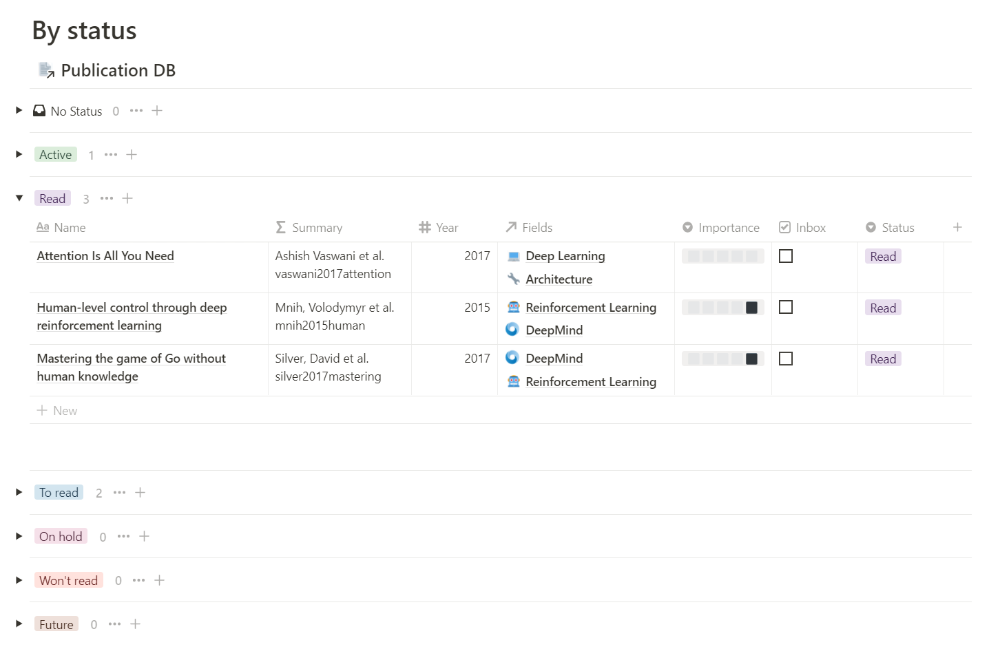

# notion-scholar

Reference management solution using Python and Notion. 

## Database 

### Preview


Each publication possess its own page, it is therefore possible to add some notes links and else to every papers.
### Requirements

The properties necessary to import publications in the database are the following:
* abstract (Text)
* year (Number)
* bibtex (Text)
* filename (Text)
* journal (Text)
* authors (Text)
* url (URL)
* inbox (Checkbox)  

The properties can have any capitalization.

## Template 

<details><summary>Images from the dashboard template</summary>
  
### Preview



  
  
### Field page  


</details>

[Link to the template](https://thomashirtz.notion.site/notion-scholar-a212906553b34a03bcb81c89837cedf6)


## Installation


```
pip install git+https://github.com/thomashirtz/notion-scholar#egg=notion-scholar
```
You can now call the application using `notion-scholar` or `ns`

## Help

For getting help it is possible to call:
```
ns --help
```

<details><summary>Output:</summary>
  
```
usage: Use "notion-scholar --help" or "ns --help" for more information

notion-scholar

positional arguments:
  {run,set,inspect-config,clear-config}
                        Selection of the action:
                        
    run                 Run notion-scholar.
    set                 Save the default values of notion-scholar.
    inspect-config      Inspect the notion-scholar config.
    clear-config        Clear the notion-scholar config.

optional arguments:
  -h, --help            show this help message and exit
```

</details>

____

Four main mode exists: `run`, `set`, ` inspect-config` and `clear-config`. The help can be called this way:
```
ns <mode> --help
```
____
```
ns run --help
```
<details><summary>Output:</summary>
  
```
usage: Use "notion-scholar --help" or "ns --help" for more information run [-h] [-t] [-db] [-f] [-s]

optional arguments:
  -h, --help            show this help message and exit
  -t , --token          Token used to connect to Notion. (Already set? True)
  -db , --database-url
                        Database that will be furnished (default: <database-url>)
  -f , --bib-file-path
                        Bib file that will be used. This argument is required if the bib file is not saved in the
                        config and no bib-string is passed. (default: <bib-file-path>)
  -s , --bib-string     Bibtex entries to add (must be in-between three quotes """<bib-string>"""). By default, the
                        entries will be saved to the bib file from the config. It is possible to disable this behavior
                        by changing the "save" option: "ns setup -save false".
```

</details>

____

```
ns set --help
```
<details><summary>Output:</summary>
  
```
usage: Use "notion-scholar --help" or "ns --help" for more information set [-h] [-f] [-s] [-t] [-db]

optional arguments:
  -h, --help            show this help message and exit
  -f , --bib-file-path
                        Save the input file path in the user config using "platformdirs". The path must be absolute
                        and the file need to exist. (default: <bib-file-path>)
  -s , --save           Set whether the entries from "bib-string" will be saved in the bib file. (default: True)
  -t , --token          Save the Notion token using "keyring".
  -db , --database-url
                        Save the database-url in the user config using the library "platformdirs". (default: <database-url>)
```

</details>

## Setting up 

### Token and database URL
For the first use it is recommended to set up the configuration file. The main parameters to save is the token (which will be securely saved using the ["keyring"](https://pypi.org/project/keyring/) library) and the database-url.
```
ns setup --token <token> --database-url <database_url>
```
or
```
ns setup -t <token> -db <database_url>
```
Note: The notion token can be found by:   
Launching a browser ⇨ Connect to [notion.so](https://www.notion.so/) ⇨ Inspect (F12) ⇨ Cookies ⇨ token_v2


### Bib file path
If you want to set the default bib path that will be used when the `ns` run is called, you can set it by typing:
```
ns setup --bib-file-path <bib_file_path>
```
or
```
ns setup -f <bib_file_path>
```

### Inspecting & clearing the configuration

It is possible to see all the configuration saved by typing:
```
ns inspect-config
```
Moreover, it is possible to erase all the config saved (token, database_url, ...) by running:
```
ns clear-config
```

### How to use ?

There is three main way to use this application:

1. [Setting up](#bib-file-path) the `bib-file-path` and call the `run` mode (It will automatically upload the new publications from the bib file into the database):
```
ns run
```
2. Giving the `bib-file-path` as argument: 
```
ns run -f <bib-file-path>
```
3. Giving a bib string as argument (/!\ be careful to type three quotes `"""` before pasting the `bib-string`) : 

```
ns run -s """"<bib-string>"""
```

## Tips
### Bibtex keys

When uploading a bibtex file into the database, the bibtex citekey will be mapped to the property "filename". This is because it seems convinient to have the same name for the key and for the filename. It is therefore advised to change the citekey before uploading to Notion.

This is ~ the nomenclature I used for the citekey [(source)](https://academia.stackexchange.com/a/139742). Feel free to take inspiration:

<details><summary>Nomenclature</summary>

`aaaayyyyxxxx.pdf`

**Where:**  
- `aaaa`: Name of the first author (variable length)
- `yyyy`: Year of publication (fixed length)
- `xxxx`: First word of title, minus articles and other small words (variable length)

**For example:**  
Attention Is All You Need, Ashish Vaswani et al., 2017

**Would give:**  
`vaswani2017attention.pdf`

If two paper publish the same year, with the same beginning of the word, I add a `1` and `2` depending on which one was first release.

For example:  
- Soft Actor-Critic Algorithms and Applications, Tuomas Haarnoja et al., 2018
  `haarnoja2018soft1.pdf`
- Soft Actor-Critic: Off-Policy Maximum Entropy Deep Reinforcement Learning with a Stochastic Actor, Tuomas Haarnoja et al., 2018
  `haarnoja2018soft2.pdf`

</details>
    
### Copy equation properties

It is possible to copy equation in the table view. [Here](https://www.reddit.com/r/Notion/comments/erdtad/comment/ff4zefs/?utm_source=share&utm_medium=web2x&context=3) is a comment to explain how, it can be very useful.

## Feedbacks

If you want to see a new feature, or you have some feedbacks to give, feel free to email me at [thomashirtz@pm.me](mailto:thomashirtz@pm.me).
