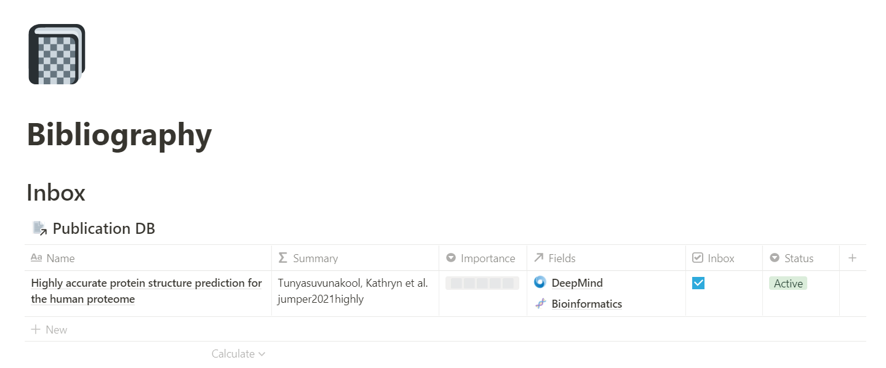

# notion-scholar

Reference management solution using Python and Notion. 

## Database 

### Preview


Each publication possess its own page, it is therefore possible to add some notes links and else to every papers.
### Requirements

The properties necessary to import publications in the database are the following:
* abstract (Text)
* year (Number)
* bibtex (Text)
* filename (Text)
* journal (Text)
* authors (Text)
* url (URL)
* inbox (Checkbox)  

The properties can have any capitalization.

## Dashboard 

### Preview



<details><summary>More images from the dashboard</summary>
  
### More database views
  
  
### Field page  


</details>

[Link to the template](https://thomashirtz.notion.site/notion-scholar-a212906553b34a03bcb81c89837cedf6)


## Installation

```
pip install git+https://github.com/thomashirtz/notion-scholar#egg=notion-scholar
```
You can now call the application using `notion-scholar` or `ns`

## Help

```
ns --help
```

```
ns run --help
```

```
ns setup --help
```

## Setting up 

### Token and database URL
For the first use it is recommended to set up the configuration file. The main parameters to save is the token (which will be securely saved using "keyring") and the database-url.
```
ns setup --token <token> --database-url <database_url>
```
or
```
ns setup -t <token> -db <database_url>
```
Note: The notion token can be found by: Going in a browser ⇨ Connect to notion.so ⇨ Inspect (F12) ⇨ Cookies ⇨ token_v2

### Input and output file paths
If you want to use an input file (file where you dump the bibtex entries) and an output file (file used as the main bibtex file), you can set the default paths by typing:
```
ns setup --input-file-path <input_file_path> --output-file-path <output_file_path>
```
or
```
ns setup -i <input_file_path> -o <output_file_path>
```

### Inspecting the configuration

It is possible to see all the configuration saved by typing:
```
ns inspect
```
